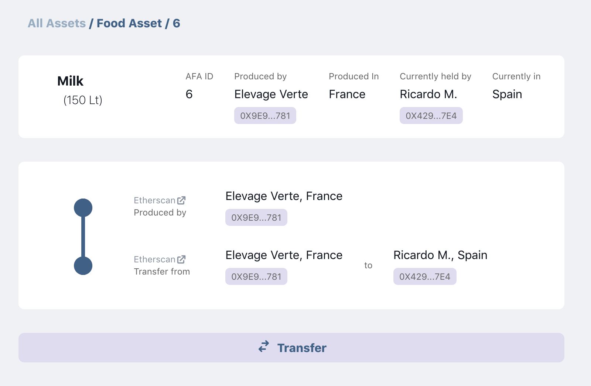
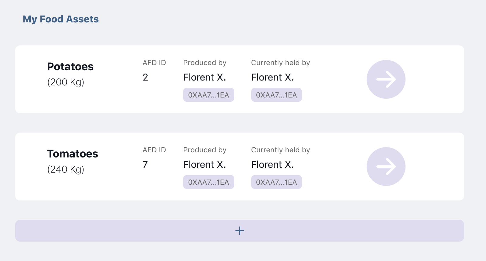
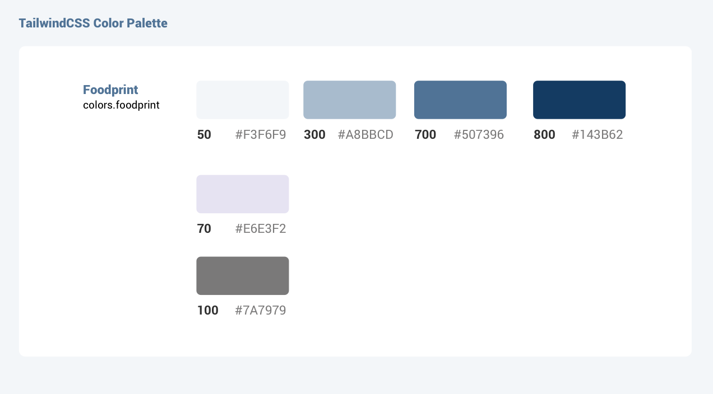

# Alector FoodPrint

> Revolutionizing food transparency & food traceability

- Deployed: [foodprint.alector.dev](https://foodprint.alector.dev)
- AFA.sol smart contract: [Alector-FoodPrint/AFP-Hardhat](https://github.com/Alector-FoodPrint/AFP-Hardhat)

## Getting Started

> This is the front-end of a decentralised app (Dapp), build with NextJS / React.

You can run the development server:

```bash
yarn dev
# or
npm run dev

```

Open [http://localhost:3000](http://localhost:3000) with your browser to see the result.

## Learn More

**AlectorFoodprint** is an experiment that utilises blockchain technology to ensure transparency and traceability of Food Products.

> What is an AFA? AFA is the symbol that corresponds to "Alector Food Asset", a traceable NFT token (ERC721) deployed by the AFA.sol smart contract.

The front-end manages Food Assets created by users (Producers) that can be then transfered to warehouses and vendors. Each Food Asset corresponds to a unique AFA (Alector Food Asset), a NFT token created by a smart contract (ERC721) deployed on Ethereum Rinkeby network. The history of registered Food Assets are traced and mapped online, in a user-friendly experience, ensuring transparency of the food chain.

This is a MVP (Minimum Vial Product) that traces 4 basic pieces of information for each Food Asset:

1. Produced by
2. Food Type (e.g. Eggs)
3. Food Subtype (e.g. Free-run)
4. Quantity

The unit of measurement is identified automatically by the combination of type and subtype (e.g. quantity of 100 corresponds to 100 Kilos if concerns type of Tomatoes, or 100 Lt if it's a type of Milk).

The experiment currently supports three type of users:

- producers (with granted access to produce new tokens / Food Assets)
- warehouses (can transfer tokens / Food Assets)
- vendors (can transfer tokens / Food Assets)

## What actions are supported for registered users?

All users must login with Metamask.

The front-end detects if the user is registered as a Producer, Warehouse or Vendor. For registered members, then a button to transfer assets appears in the screen, which is visible only if logged in user is also the owner of this Food Asset (only owners can transfer their AFA token).



If the user is a registered Producer, then a button to create new assets appears on the screen (in "My Profile"). This option is visible only to producers.



## Technical issues

### State & separation of concerns

The context for _Chakra_ and _Web3Provider_ is included centrally in `/pages/_app.js`, which consists "the heart" of a typical NextJS application.

File: `/pages/_app.js`

```js
// _app.js
<ChakraProvider>
  <Web3Provider>
    <ContextWrapper>
      <Component {...pageProps} />
    </ContextWrapper>
  </Web3Provider>
</ChakraProvider>
```

However, the state of the application that carries all the important (global) objects and variables was added in the layout.

Currently the application consists solely of a single layout of Dashboard type (`<DashboardLayout>`) that is included separately in every single NextJS page (but not in `_app.js`). So technically, in the future, different layouts can be added in new pages (e.g. a different layout for a blog).

Notes:

- Separation of concern requires two separate contexts and providers (`contextData` and `contextAfp`) for two separate types of context that change independently (according to official React documentation)
- All state of blockchain accounts (user name, address, city etc.) is provided by `contextData.Provider` that, in the future, can retreive the data from a database or an API. The state of the smart contract is found in the `contextAfp.Provider`

File: `/context/context-wrapper.js`

```js
<contextData.Provider value={globalData}>
  <contextAfp.Provider value={myNFT}>
    <div>{props.children}</div>
  </contextAfp.Provider>
</contextData.Provider>
```

## Custom Hooks

Currently the application operates only only two types of transaction with the blockchain:

- register new NFT token to the blockchain (create a new food object), only if the user is also registered as producer by an adiminstrator
- transfer an existing food object, only if the person who transfers also owns the NFT token.

Nevertheless, the transactions were designed with a custom hook that supports _any type_ of transaction, in order to be able to scale up the application in the future, if necessary.

### useContractTransaction

File: `/components/box-produce-asset.js`

```js
import useContractTransaction from "/hooks/useContractTransaction"

const [txLoading, setProducePromise, txSuccess] = useContractTransaction("Food Asset was succesfully produced", "")

const handleProduceAsset = async e => {
  if (myContract) {
    e.preventDefault()
    setProducePromise(myContract.Produce(quantity, selectedCategoryNum, selectedSubcategoryNum))
  }
}
```

Notes:

- txLoading: returns true if the promise is loading (connection with the blockchain)
- setProducePromise: The promise `myContract.Produce(quantity, selectedCategoryNum, selectedSubcategoryNum` is hardcoded inside the function that controls the button component. This makes it easy to add different promise in different button and reuse only one line of code with a custom hook.
- txSuccess: returns true if the transaction was successful

## Custom hooks for special functionalities

| hook name            | functionality                                                              | example                                                                                              |
| -------------------- | -------------------------------------------------------------------------- | ---------------------------------------------------------------------------------------------------- |
| useDashboardUser     | User authentication. Redirects in Login page if user is not authenticated. | `const { web3State } = useDashboardUser()`                                                           |
| useReadContractUser  | Retreives all NFTs owned by a user.                                        | `const [ownedIDs, isLoading, isError] = useReadContractUser(myContract, userHash)`                   |
| useReadFoodAsset     | Retreive NFT details based on ID.                                          | `const [foodObject, isLoading, isError, setFaRefreshed] = useReadFoodAsset(myContract, tokenId) `    |
| useReadTransferEvent | Retreive the Transfer event history of a NFT token.                        | `const [eventList, isLoading, isError, setTransRefresh] = useReadTransferEvent(myContract, tokenId)` |

# Custom design & color palette

The front-end design was made with `Sketch` and materialised with `TailwindCss`. A set of custom colors were added in Tailwind CSS configuiration file.

```js

  theme: {
    extend: {
      colors: {
        foodprint: {
          50: "#F3F6F9",
          70: "#E6E3F2",
          100: "#7A7979",
          300: "#A8BBCD",
          700: "#507396",
          800: "#143B62"
        }
      }
    }

```

Therefore, the JSX has access custom **utility classes** like `bg-foodprint-700` or `text-foodprint-700` along with all standard Talwind utility classes (like `text-center`).

Example:

```html
<button className="bg-foodprint-700 hover:bg-foodprint-800 text-center ">{description}</button>
```


