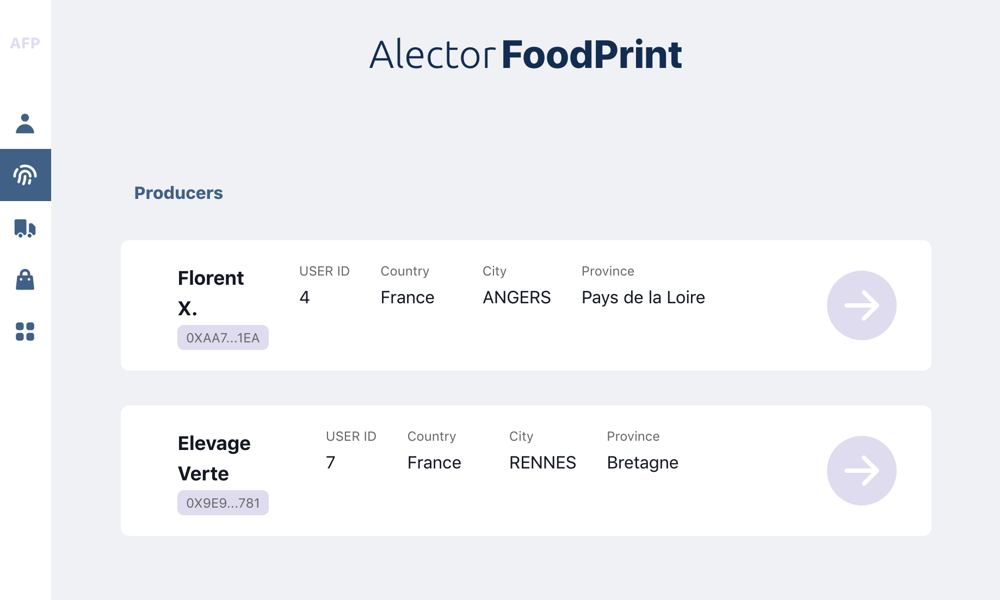
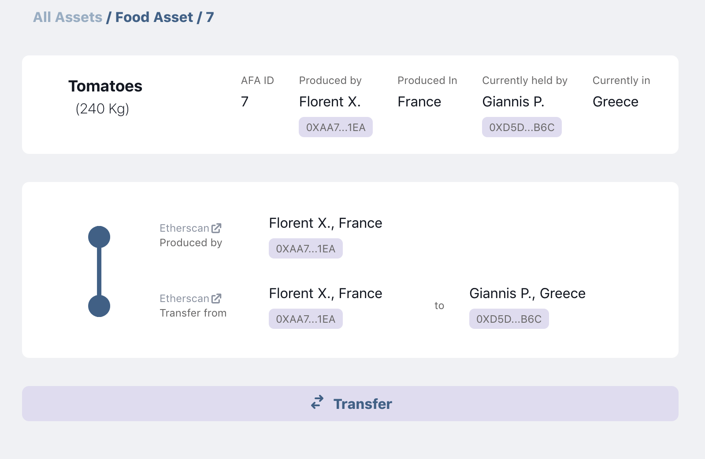

# Alector FoodPrint

> Revolutionizing food transparency & traceability

- Deployed: [foodprint.alector.dev](https://foodprint.alector.dev)
- AFA.sol smart contract: [Alector-FoodPrint/AFP-Hardhat](https://github.com/Alector-FoodPrint/AFP-Hardhat)



## Getting Started

> This is the front-end of a decentralised app (Dapp), build with NextJS / React.

You can run the development server:

```bash
yarn dev
# or
npm run dev

```

Open [http://localhost:3000](http://localhost:3000) with your browser to see the result.

## Learn More

**AlectorFoodprint** is an experiment that utilises blockchain technology to ensure transparency and traceability of Food Products.

> What is an AFA? AFA is the symbol that corresponds to "Alector Food Asset", a traceable NFT token (ERC721) deployed by the AFA.sol smart contract.

The front-end manages Food Assets created by users (Producers) that can be then transfered to warehouses and vendors. Each Food Asset corresponds to a unique AFA (Alector Food Asset), a NFT token created by a smart contract (ERC721) deployed on Ethereum Rinkeby network. The history of registered Food Assets are traced and mapped online, in a user-friendly experience, ensuring transparency of the food chain.

This is a MVP (Minimum Vial Product) that traces 4 basic pieces of information for each Food Asset:

1. Produced by
2. Food Type (e.g. Eggs)
3. Food Subtype (e.g. Free-run)
4. Quantity

The unit of measurement is identified automatically by the combination of type and subtype (e.g. quantity of 100 corresponds to 100 Kilos if concerns type of Tomatoes, or 100 Lt if it's a type of Milk).

The experiment currently supports three type of users:

- producers (with granted access to produce new tokens / Food Assets)
- warehouses (can transfer tokens / Food Assets)
- vendors (can transfer tokens / Food Assets)

## What actions are supported for registered users?

All users must login with Metamask.

The front-end detects if the user is registered as a Producer, Warehouse or Vendor. For registered members, then a button to transfer assets appears in the screen, which is visible only if logged in user is also the owner of this Food Asset (only owners can transfer their AFA token).



If the user is a registered Producer, then a button to create new assets appears on the screen (in "My Profile"). This option is visible only to producers.


